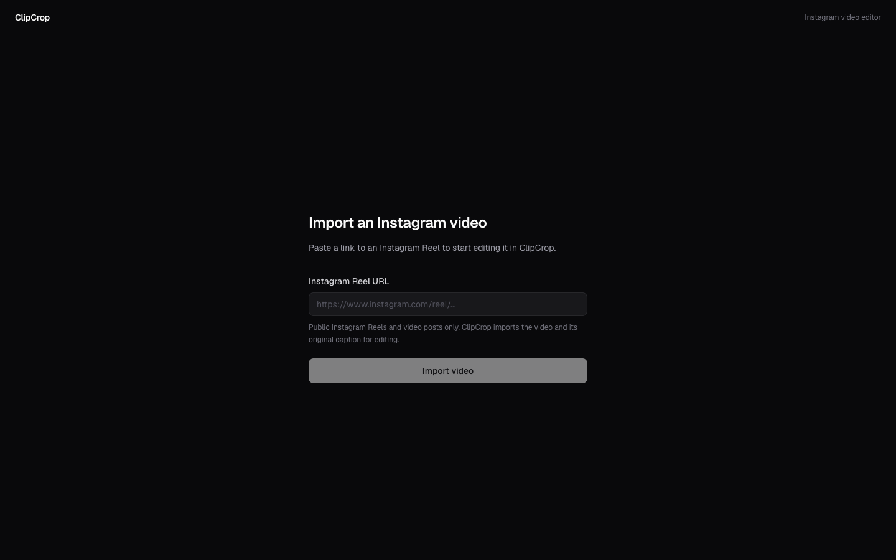
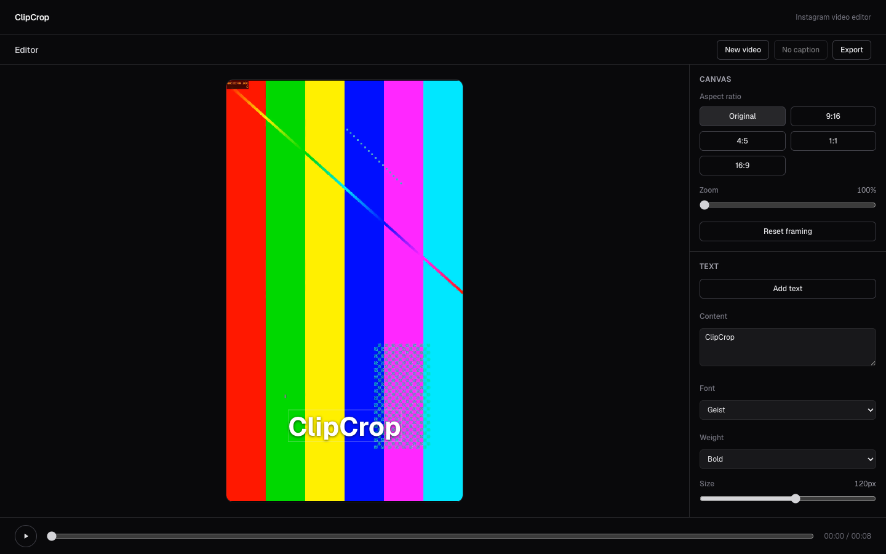

# ClipCrop

ClipCrop is a browser-based Instagram video editor. Paste a public Instagram
Reel or video post URL, and ClipCrop imports the video with yt-dlp, opens it in
a Remotion-powered editor, and exports an edited MP4 together with the original
caption. Downloads are named after the post's shortcode (e.g.
`DbhOdVpKygF.mp4`, `DbhOdVpKygF.txt`, `DbhOdVpKygF.zip`).

## What it does

```
Instagram URL → import → edit → export MP4 / ZIP + caption
```

1. Paste a public Instagram Reel or video post URL.
2. The server validates the URL, downloads the video with yt-dlp, extracts the
   caption, and probes duration/dimensions with ffprobe.
3. The video is served back to the browser through a Range-capable route and
   loaded into the editor through the Zustand store.
4. Edit the framing, crop precisely, and add text overlays in the Remotion
   Player. Save the setup as a preset and reuse it on other videos.
5. Export renders the same composition in the browser and downloads the edited
   video (`<shortcode>.mp4`), or packages it with the caption as
   `<shortcode>.zip`.
6. Download the original fetched video or the Instagram caption directly.

## Features

- Public Instagram Reel/video import (yt-dlp, no login or cookies)
- Original caption extraction and download
- Precise crop rectangle (edges + corners, move, 5% minimum, keyboard resize)
  locked to the output aspect ratio, plus a Free mode where the crop shape
  becomes the output aspect ratio
- Crop, reposition, and 100–300% zoom with geometry clamping
- Output aspect ratios: Original, 9:16, 4:5, 1:1, 16:9
- Multiple text layers with font, weight, size, color, alignment, shadow, and
  opacity
- Reusable presets (crop, framing, aspect ratio, and text styling) saved in
  localStorage and applicable to other videos with normalized geometry
- Direct canvas manipulation: drag video, drag text, click to select/deselect
- Keyboard shortcuts: Delete/Backspace, Escape, arrow nudging (1 px / 10 px)
- Browser-side MP4 export (H.264/AAC) with real progress and cancellation
- ZIP export (edited video + caption) with no video re-encoding
- Original source video download without re-running yt-dlp
- Shortcode-based filenames for every download
- Safe "New video" flow with unsaved-edit confirmation and unload protection
- Production safeguards: import limits, tool health checks, temp cleanup

## Screenshots

Import screen:



Editor (development sample fixture, text overlay selected):



## Architecture

```
Browser
  ├─ /                import form
  └─ /editor          Remotion Player + inspector + playback bar
        │  Zustand store (media, metadata, aspect ratio, transform, text layers)
        │  createClipRenderInput(document)
        ▼
  ClipComposition (Remotion)  ── preview via @remotion/player
                              └─ export via @remotion/web-renderer → MP4 download

Server (Node runtime)
  POST /api/import                  validate → tools → limits → yt-dlp → ffprobe → temp storage
  GET  /api/imports/:id/video       Range-capable media streaming
  GET  /api/health                  tool availability
        │
        ▼
  .tmp/imports/<uuid>/              video.* + metadata.json (TTL cleanup)
```

See [docs/architecture.md](docs/architecture.md) for the full description.

## Tech stack

Frontend:

- Next.js 16 (App Router), React 19, TypeScript
- Tailwind CSS v4
- Zustand 5 for the editor document
- Remotion 4: `@remotion/player`, `@remotion/media`

Server:

- Next.js route handlers on the Node runtime
- yt-dlp for Instagram extraction
- ffprobe for authoritative media metadata
- Local temporary storage under `.tmp/imports`

Rendering:

- `@remotion/web-renderer` with WebCodecs for in-browser MP4 encoding
- Remotion composition shared between preview and export
- `client-zip` for streaming, uncompressed ZIP packaging (no MP4 re-encode)

Tooling:

- pnpm, ESLint, Prettier

## Application flow

```mermaid
flowchart LR
  U[Instagram URL] --> A[POST /api/import]
  A --> Y[yt-dlp download]
  Y --> P[ffprobe metadata]
  P --> L{duration/size limits}
  L --> T[.tmp/imports/uuid]
  T --> R[GET /api/imports/:id/video]
  R --> Z[Zustand setMedia]
  Z --> PL[Remotion Player]
  PL --> W[@remotion/web-renderer]
  W --> D[shortcode.mp4]
  W --> ZP[client-zip]
  ZP --> ZF[shortcode.zip: mp4 + txt]
  Z --> C[shortcode.txt]
  Z --> S[Download source]
  Z --> PS[Presets in localStorage]
```

## Local development

Requirements:

| Requirement   | Notes                                                                 |
| ------------- | --------------------------------------------------------------------- |
| Node.js 20.9+ | Node 22 LTS recommended                                               |
| pnpm          | Version pinned in `package.json` (`packageManager`)                   |
| yt-dlp        | Required; install with `brew install yt-dlp` or `pipx install yt-dlp` |
| ffprobe       | Required; comes with FFmpeg (`brew install ffmpeg`)                   |
| ffmpeg        | Optional; yt-dlp may use it to merge separate streams                 |

```bash
pnpm install
pnpm dev
```

Open http://localhost:3000. In development, `/editor` uses the synthetic sample
fixture in `public/sample-video.mp4`; in production the sample is never
editable and `/editor` shows a "No video imported" screen instead.

The fixture is generated with FFmpeg (no third-party footage):

```bash
ffmpeg -y -f lavfi -i "testsrc2=size=1080x1920:rate=30" -t 8 \
  -c:v libx264 -preset slow -crf 30 -pix_fmt yuv420p \
  -g 30 -keyint_min 30 -sc_threshold 0 -movflags +faststart -an \
  public/sample-video.mp4
```

Properties: 1080×1920, 30 fps, 8 seconds (240 frames), H.264/yuv420p, no audio.

## Production build

```bash
pnpm build
pnpm start
```

`GET /api/health` returns `200` when the required media tools are available and
`503` otherwise. Tool availability is cached per server process; restart the
server after installing missing tools.

## Environment variables

All limits have sane defaults and are validated at startup; invalid values log a
warning and fall back to the default.

| Variable                              | Default              | Purpose                                             |
| ------------------------------------- | -------------------- | --------------------------------------------------- |
| `CLIPCROP_MAX_VIDEO_DURATION_SECONDS` | `300`                | Reject longer imports (`422 VIDEO_TOO_LONG`)        |
| `CLIPCROP_MAX_VIDEO_BYTES`            | `209715200` (200 MB) | Reject larger downloads (`422 VIDEO_TOO_LARGE`)     |
| `CLIPCROP_MAX_CONCURRENT_IMPORTS`     | `2`                  | Per-instance yt-dlp concurrency (`429 IMPORT_BUSY`) |
| `CLIPCROP_IMPORT_TTL_HOURS`           | `6`                  | Age after which temp imports are cleaned up         |

## Docker

A production image is provided in `Dockerfile` (multi-stage, Node 22 Alpine,
non-root `node` user, `yt-dlp` and FFmpeg installed, writable
`/app/.tmp/imports`, healthcheck on `/api/health`):

```bash
docker build -t clipcrop .
docker run --rm -p 3000:3000 clipcrop
curl http://localhost:3000/api/health
```

Status: the Dockerfile is provided, but its build and runtime have **not been
verified** in the development environment used for this repository (no
container runtime was available). Verify with the commands above and the
release checklist before relying on it. The build downloads the standalone
yt-dlp binary for the target architecture, so it needs network access.

## Runtime requirements

- A long-running Node.js server (not Edge, not static hosting).
- `yt-dlp` and `ffprobe` executables on `PATH` (`ffmpeg` recommended).
- A writable local filesystem for `.tmp/imports` that survives the editing
  session (up to the import TTL).
- HTTP responses that support long-lived media streaming and Range requests.

## Deployment

Suitable: VPS, Docker host, or a persistent Node container platform
(Railway, Fly.io, Render, and similar).

CI runs on every push to `main` and every pull request. Automated production
deployment is documented (and currently pending server verification) in
[docs/deployment.md](docs/deployment.md).

Not suitable without changes: purely static hosting, Edge runtimes, and
ephemeral serverless platforms where the local filesystem is not durable across
requests/instances, arbitrary binaries are unavailable, or processes are
heavily restricted. There is no universal Vercel compatibility claim.

Baseline response headers are set for all routes
(`X-Content-Type-Options: nosniff`,
`Referrer-Policy: strict-origin-when-cross-origin`, `X-Frame-Options: DENY`).
A Content-Security-Policy is intentionally not set: Remotion's browser renderer
relies on WebCodecs, workers, blob URLs, and canvas capture, and a naive CSP
would break playback and export.

## Limitations

- Public Instagram content only; private/login-required posts return an error.
- Instagram changes its extractor behavior over time; failures surface as
  structured API errors rather than silent retries.
- Only the primary video of a carousel post is imported; no media picker.
- Editor documents are session-only; a refresh resets the document. Presets are
  the only persisted state, stored per browser in localStorage.
- Imported media lives in local temp storage and expires (default 6 hours).
- Browser export requires WebCodecs and an H.264 encoder (Chrome, Edge, or
  Firefox; Safari depends on the platform encoder). The editor itself still
  works without export support.
- ZIP export holds the rendered MP4 blob and the archive blob in memory at the
  same time; practical for the default 200 MB source limit, but not for very
  large renders. `client-zip` stores files without compression.
- Crop handles support mouse, trackpad, and touch dragging plus arrow-key
  resizing when focused; moving the whole crop box is pointer-only.
- No per-IP rate limiting is built in; use a reverse proxy if needed.
- The concurrency limiter is per server instance, not global.

## Security

- Instagram URLs are parsed and validated (host, scheme, path, shortcode);
  arbitrary URLs never reach yt-dlp.
- External processes are started with `spawn` and argument arrays; no shell
  interpolation, no user-controlled flags.
- Server-side duration, file-size, and concurrency limits bound resource use;
  rejected imports delete their workspace.
- The media route only serves files inside a validated import workspace
  (UUID ids, basename-checked filenames, prefix-checked paths).
- No Instagram credentials, cookies, or private content are collected.
- Imported media is never uploaded anywhere; exports stay in the browser.

## Project structure

```
src/
  app/
    page.tsx                     import screen
    editor/page.tsx              editor route
    api/import/route.ts          import API
    api/imports/[id]/video/      Range-capable media route
    api/health/route.ts          tool health
  components/
    editor/                      editor shell, preview, crop overlay, inspector,
                                 playback, presets/export hooks
    import/                      import form
    ui/                          shared Button
  lib/
    editor.ts                    crop/transform geometry, canvas sizes, dirty state
    text-layer.ts                text layer model helpers and styles
    filenames.ts                 source-id based download filenames
    presets.ts                   preset model, serialization, apply
    preset-storage.ts            versioned localStorage persistence
    export-zip.ts                streaming ZIP packaging (client-zip)
    instagram-url.ts             URL validation and shortcode extraction
    keyboard.ts                  editable-target guard
    server/                      yt-dlp, ffprobe, temp storage, limits, tooling
  remotion/
    compositions/clip-composition.tsx
    clip-render-input.ts         deterministic render input
    export-config.ts             export configuration
  store/                         Zustand store and selectors
  types/                         shared editor and API types
public/sample-video.mp4          development fixture
docs/                            architecture, API, editor, testing, checklist
```

## Documentation

- [Architecture](docs/architecture.md)
- [Server API](docs/api.md)
- [Editor behavior](docs/editor.md)
- [Testing strategy](docs/testing.md)
- [Deployment](docs/deployment.md)
- [Release checklist](docs/release-checklist.md)

## Development history

ClipCrop was built in incremental phases (0–11): project bootstrap, editor
shell, Remotion foundation, crop/reposition, text overlays, Zustand state
architecture, Instagram ingestion, browser rendering and downloads, UX
hardening, production hardening, and the precise-crop/presets/download
workflow. Every feature landed as its own commit; use `git log` for the full
history.

## License

No license has been chosen for this repository.
